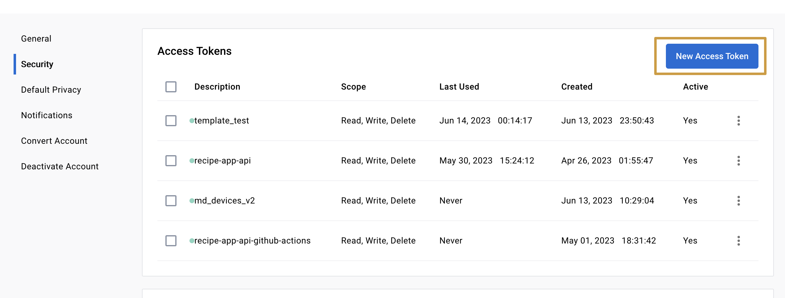
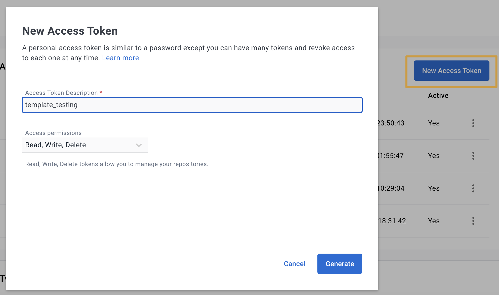
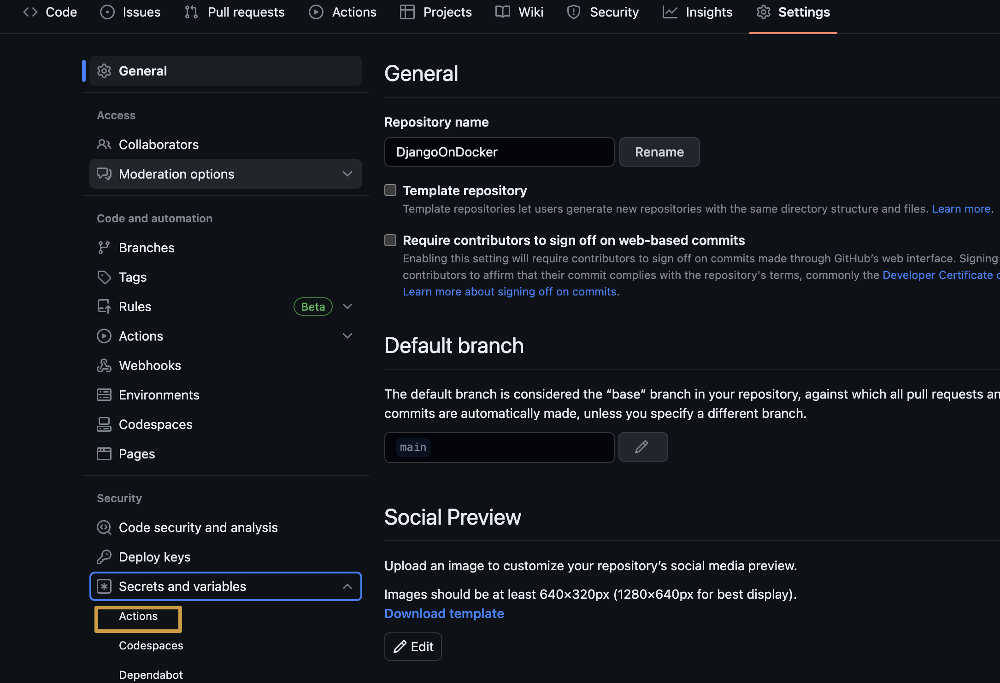
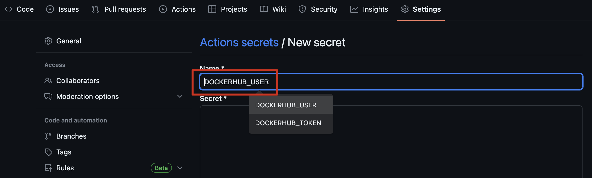
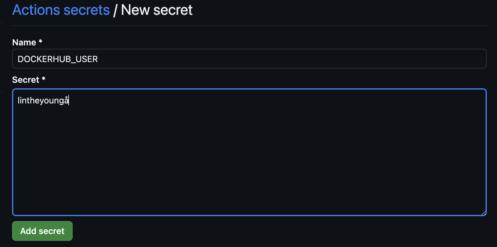
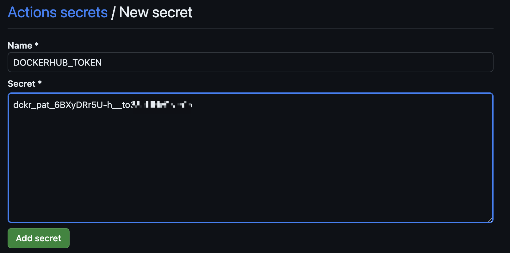

# DjangoOnDocker
🚀 基于Docker的Django开发利器：一套高效的基于Docker的Django 3.2开发和部署环境，内建Django REST框架支持，整合PostgreSQL数据库，集成Flake8代码检查，支持测试驱动开发，并通过GitHub Actions实现无缝的CI/CD流程。

## 特性：

*   基于Django 3.2
*   支持Django REST framework (DRF)
*   使用PostgreSQL数据库 (通过Docker容器)
*   集成Flake8代码格式检查工具
*   支持使用测试驱动开发（TDD）方法
*   集成Github Actions，方便CI/CD流程

## 使用方法：

### 添加Github Action

#### 自定义
1.  进入GitHub仓库，在仓库根目录创建一个`.github/workflows`目录。
2.  在`.github/workflows`目录下修改`checks.yml`文件，并配置你的GitHub Action。

#### 使用项目配置












### 构建与启动

1.  克隆仓库到本地：

    ```bash
    git clone https://github.com/lintheyoung/DjangoOnDocker
    ```

2.  进入仓库目录：

    ```bash
    cd DjangoOnDocker
    ```

3.  构建Docker镜像：

    ```bash
    docker build .
    ```
    
4.  使用Docker Compose构建服务：
    
    ```bash
    docker-compose build
    ```

5.  启动服务：

    ```bash
    `docker-compose up`
    ```


### 格式检查

使用Flake8进行代码格式检查：

```bash
docker-compose run --rm app sh -c "flake8"
```

### 运行测试
执行Django的单元测试：

```bash
docker-compose run --rm app sh -c "python manage.py test"
```

### TIPs
项目需要docker composer 2+版本，在Ubuntu下可以使用如下安装：
```bash
mkdir -p ~/.docker/cli-plugins
curl -SL https://github.com/docker/compose/releases/download/v2.2.3/docker-compose-linux-x86_64 -o ~/.docker/cli-plugins/docker-compose
chmod +x ~/.docker/cli-plugins/docker-compose
```
这里使用`docker compose`代替之前的`docker-compose`，如查看版本命令如下：
```bash
docker compose version
```

## 贡献

如果你有好的意见或建议，请随时通过 `Pull Request` 向我们提交。

## 许可证

请参见仓库中的 `LICENSE` 文件。
